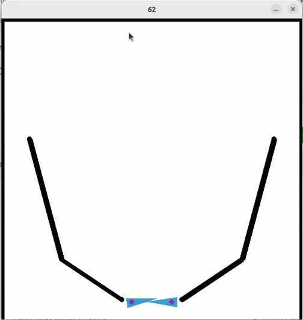

 
<h1>Pinball</h1>

#### Status: Finalizado

## Sobre

Estava com vontade de tentar fazer algo fora da area de desenvolvimento web e resolvi criar um jogo simples e escolhi o pinball.
 
## Instalação

### Requisitos

- Python 3.11.4
- pygame 2.5.0
- pymunk 6.5.1

### Instalação

- Instalando as dependências com: <code>pip install -r requirements.txt</code>
- Para iniciar o jogo <code>python main</code>
- Controles: Seta direita e esquerda controla os flippers, seta cima e baixo controlar o lançamento da bola.
